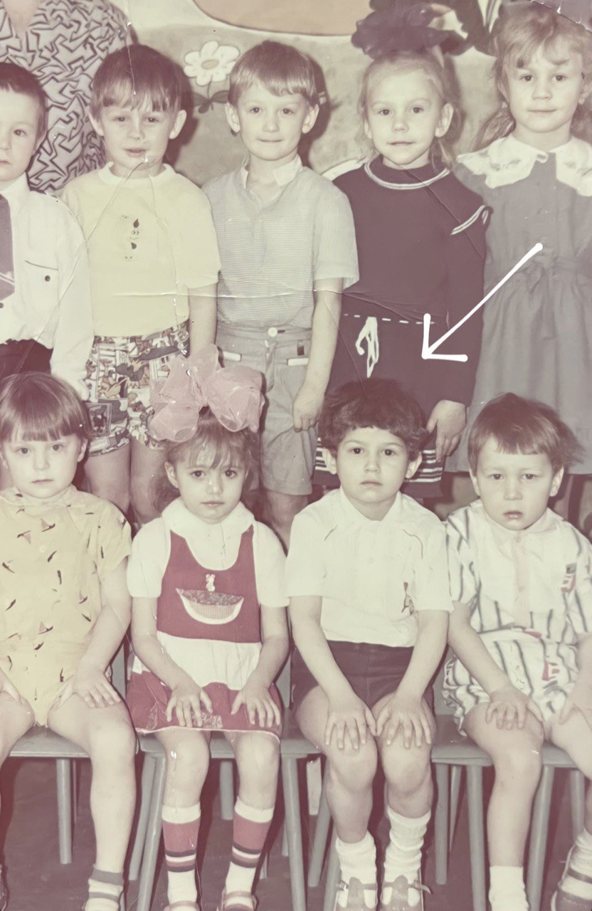

##  Бенцион Вишер #

33 года, образование среднее-специальное 06.2008, люблю потешествовать, не люблю читать, но стараюсь приучать себя к этому, в школьные годы ходил в музыкальную школу, активно участвовал в культ-массовом секторе, с детства люблю порядок, чтобы все по своим метсам, все по полочкам. При этом уборку – не очень. Нравятся детективные сериалы и телек в принципе)

* Владение английским на базовом уровне (очень базовом)
* Управление самолетом (во сне)
* Вязание крючком
* Плетение бисером
* Умение быстро адаптироваться к новым условиям

